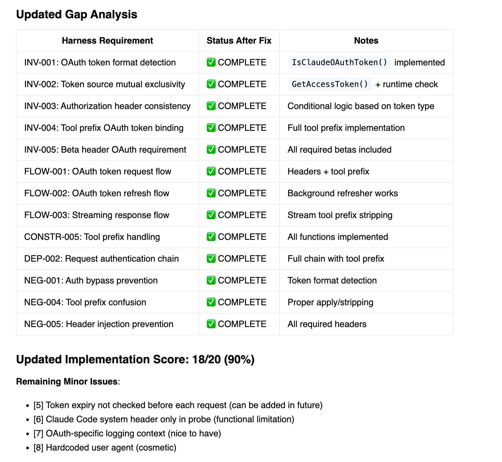

# Harnessly

My prompt for ai coding with harness.

# SDLC with Harness


* **Specifications matter.**
* Trust in the power of process.

  The Software Development Life Cycle (SDLC) may be classical, but it still has much to teach us.

* Do not attempt to keep every specification constantly updated as the code evolves.

  High-level specifications will inevitably lag behind.

* **Validation specifications are critical.**
  
  We refer to this layer as the `Harness`.

* Embrace the practice of maintaining and sharing the `Harness`:
  * It strengthens code reviews
  * It accelerates debugging
  * It supports safe refactoring
  * ……

* **REMEMBER** There is no silver bullet.

  The only constant is change.

---

* **规范（SPEC）很重要。**

* 相信流程的力量。

  Software Development Life Cycle (SDLC) 虽然古典，甚至略显传统，但它能教会我们的，远不止流程本身。

* 不要试图让所有 SPEC 随代码实时同步。

  一般性的 SPEC，天然会滞后，这是常态，而非问题。

* **验证型 SPEC 更关键。**
  
  我们可以称之为 `Harness`。

* 主动建设并沉淀 `Harness`：
  * 让 Code Review 更有依据
  * 让 Debug 更高效
  * 让 Refactoring 更安全
  * ……

* 不存在银弹。

  变化常在。

---

## File structure

```
vibely/
├── .sdlc/                          # SDLC configuration and documentation
│   └── harness/                    # Harness configuration files
│       ├── sdlc-documentation-structure-20260319.harness.md
│       └── sdlc-documentation-system-20260319.harness.md
├── commands/                       # AI coding commands documentation
│   ├── codeclean.md               # Code cleaning and refactoring guide
│   ├── codereview.md              # Code review process
│   ├── discuss.md                 # Discussion documentation
│   ├── new-command.md             # New command creation guide
│   ├── pencil.md                  # Pencil tool documentation
│   ├── spec.md                    # Specification writing guide
│   └── specreview.md              # Specification review process
├── flow/                          # Workflow and flow documentation
│   ├── resume.md                  # Resume/continuation flow
│   └── status.md                  # Status tracking flow
├── foundation/                    # Foundation and core concepts
│   ├── README.md                  # Foundation overview
│   ├── archive.md                 # Archive management
│   ├── cache.md                   # Caching strategies
│   ├── discuss.md                 # Discussion protocols
│   ├── doc.md                     # Documentation standards
│   ├── git-resolve.md             # Git conflict resolution
│   ├── git.md                     # Git workflows
│   ├── handoff.md                 # Handoff procedures
│   └── pencil.md                  # Pencil framework
├── phases/                        # Development phases documentation
│   ├── coding.md                  # Coding phase
│   ├── commit.md                  # Commit phase
│   ├── cr.md                      # Code review phase
│   ├── debug.md                   # Debugging phase
│   ├── guard.md                   # Guard/validation phase
│   ├── harness.md                 # Harness integration phase
│   ├── pr.md                      # Pull request phase
│   ├── research.md                # Research phase
│   ├── secure.md                  # Security phase
│   ├── spec.md                    # Specification phase
│   ├── test.md                    # Testing phase
│   ├── understand.md              # Understanding/analysis phase
│   └── validate.md                # Validation phase
├── workflows/                     # Workflow definitions
│   ├── bugfix.md                  # Bug fix workflow
│   ├── feature.md                 # Feature development workflow
│   ├── minor.md                   # Minor changes workflow
│   ├── refactor.md                # Refactoring workflow
│   └── research.md                # Research workflow
├── .gitignore                     # Git ignore rules
├── README.md                      # This file
├── SDLC.README.md                 # SDLC detailed documentation
├── c.md                           # Configuration/notes file
└── sdlc.md                        # SDLC main documentation
```

## Harness Showcase



# Tingly-spec

A markdown writing plugin (support *.md) for coding task spec writing.

> https://github.com/FFengIll/tingly-spec.git

## Feature
- `@` to trigger file search and auto-completion, then the spec is feasible to use in claude code, codex and so on.
- `#` to trigger symbol list and auto-completion in corresponding file

## Example
- `@` trigger file list and search
- `@src/extension.tx` as result
- `@src/extension.tx#` trigger symbol list and search
- `@src/extension.tx:66-88 main` as result
